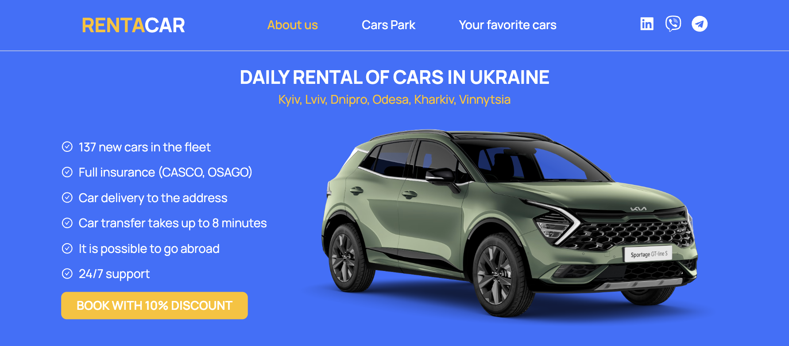
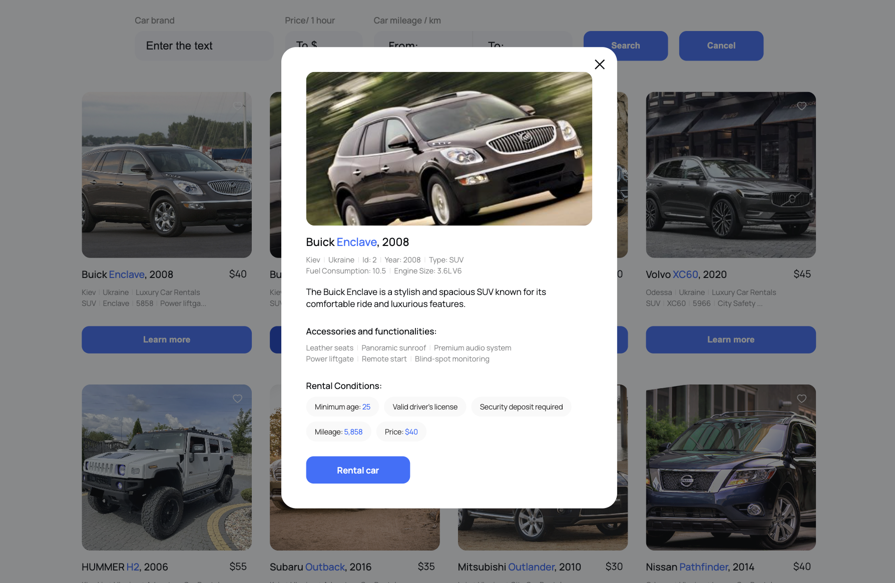

# Car Rental Web Application
<h1 align="center">RENTACAR</h1>

  

This web application offers a diverse selection of rental cars to suit every taste. Users can browse through a wide catalog of cars and use the convenient sorting feature based on their preferences. Sorting options include models, prices, and mileage. Additionally, users can add their favorite cars to a corresponding list for quick access. For detailed information about a car, users can click the "Learn More" button to open a modal window.

## Functionality

- **Extensive Car Catalog**: Browse a wide range of cars to find the perfect fit for your needs.

  

- **Convenient Sorting**: Use the sorting form to arrange cars by models, prices, and mileage according to your preferences.

- **Favorites List**: Easily add favorite cars to your list for quick access..

  

- **Detailed Information**: Get comprehensive information about a car by clicking the "Learn More" button to open a modal window.

  

## Usage

- Explore the catalog by navigating to the "Catalog" page.

- Use the sorting form to arrange cars based on your preferences.

- Click the "Add to Favorites" button to add a car to your favorites list.

- For detailed information about a car, click the "Learn More" button to open a modal window.

## Technologies and Dependencies

#### React:
React is a JavaScript library for building user interfaces that allows you to create dynamic and high-performing web applications. GooseTracks is based on React, making it easy to create components and manage the application's state.

#### React-Redux:
React-Redux is a library for integrating Redux into your React applications, simplifying the communication between Redux state and React components.

#### Redux Toolkit:
Redux Toolkit is a library for managing your application's state in React projects. It helps organize and streamline state management by centralizing it and providing debugging tools.

#### React Router DOM:
React Router DOM is a library for navigation and routing in React applications, allowing you to create routes and navigate between pages.

### Slick-Carousel: 
Slick-Carousel is a library for creating carousel sliders for web pages. It provides convenient and powerful tools for creating and managing dynamic sliders that can be used for presentations of images, videos, texts, and other content.

### React-Icons:
React-Icons is an icon library for React projects. It provides access to a large set of icons that can be used directly in your application as React components.

### Thank you for choosing our car rental web application for your automotive needs!
