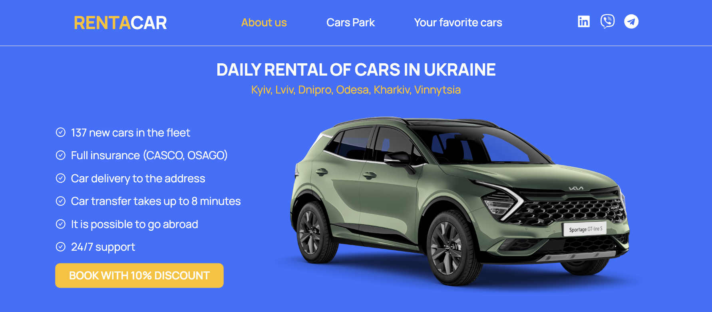
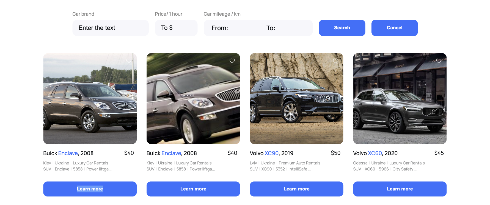
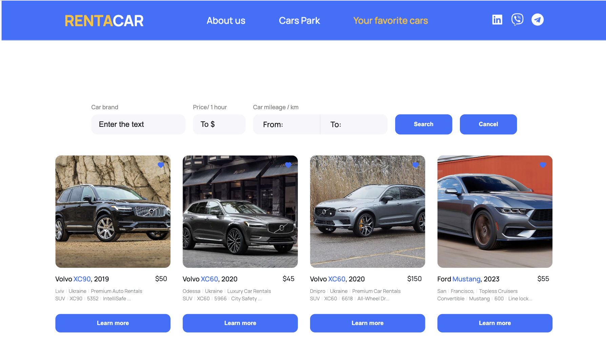

# Веб-додаток прокату автомобілів
<h1 align="center">RENTACAR</h1>

  

Цей веб-додаток пропонує різноманітний вибір прокатних автомобілів на будь-який смак. Користувачі можуть оглядати великий каталог автомобілів і використовувати зручну функцію сортування за їх власними уподобаннями. Варіанти сортування включають моделі, ціни та пробіг. Крім того, користувачі можуть додавати улюблені автомобілі до відповідного списку для швидкого доступу. Для отримання докладної інформації про автомобіль, користувачі можуть натискати кнопку "Дізнатися більше", щоб відкрити модальне вікно.

## Функціонал

- **Обширний каталог автомобілів**: Переглядайте широкий асортимент автомобілів, щоб знайти ідеальний варіант для своїх потреб.

  

- **Зручне сортування**: Використовуйте форму сортування, щоб впорядкувати автомобілі за моделями, цінами та пробігом відповідно до ваших уподобань.

- **Список улюблених**: Легко додавайте улюблені автомобілі до свого списку для швидкого доступу.

  

- **Детальна інформація**: Отримуйте вичерпну інформацію про автомобіль, натискавши кнопку "Дізнатися більше", щоб відкрити модальне вікно.

  

## Використання

- Досліджуйте каталог, перейшовши на сторінку "Каталог".

- Використовуйте форму сортування, щоб впорядкувати автомобілі за своїми уподобаннями.

- Натискайте кнопку "Додати до улюблених", щоб додати автомобіль до списку улюблених.

- Для отримання детальної інформації про автомобіль натискайте кнопку "Дізнатися більше", щоб відкрити модальне вікно.

## Технології та Залежності

#### React:
React - це JavaScript-бібліотека для створення користувацьких інтерфейсів, що дозволяє створювати динамічні та високопродуктивні веб-додатки. GooseTracks базується на React, що спрощує створення компонентів та управління станом додатку.

#### React-Redux:
React-Redux - це бібліотека для інтеграції Redux у ваші додатки React, спрощуючи зв'язок між станом Redux та компонентами React.

#### Redux Toolkit:
Redux Toolkit - це бібліотека для управління станом вашого додатку в проектах React. Вона допомагає організувати та спростити управління станом, централізуючи його та надаючи інструменти для відлагодження.

#### React Router DOM:
React Router DOM - це бібліотека для навігації та маршрутизації в додатках React, яка дозволяє створювати маршрути та навігацію між сторінками.

### Slick-Carousel: 
Slick-Carousel - це бібліотека для створення карусельних слайдерів веб-сторінок. Вона надає зручні та потужні засоби для створення і керування динамічними слайдерами, які можна використовувати для презентацій зображень, відео, текстів та іншого контенту.

### React-Icons:
React-Icons - це бібліотека іконок для React-проєктів. Вона надає доступ до великого набору іконок, які можна використовувати в вашому додатку безпосередньо як компоненти React.

### Дякуємо, що ви обрали наш веб-додаток прокату автомобілів для ваших автомобільних потреб!